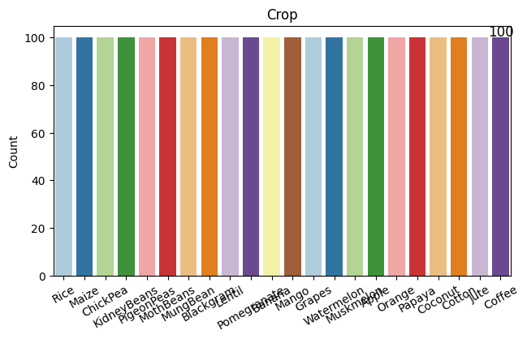
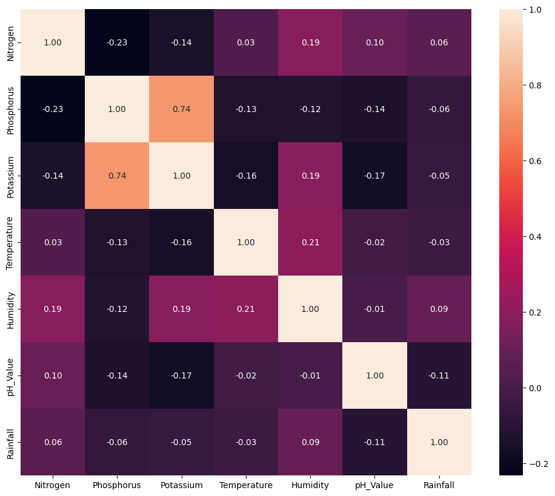
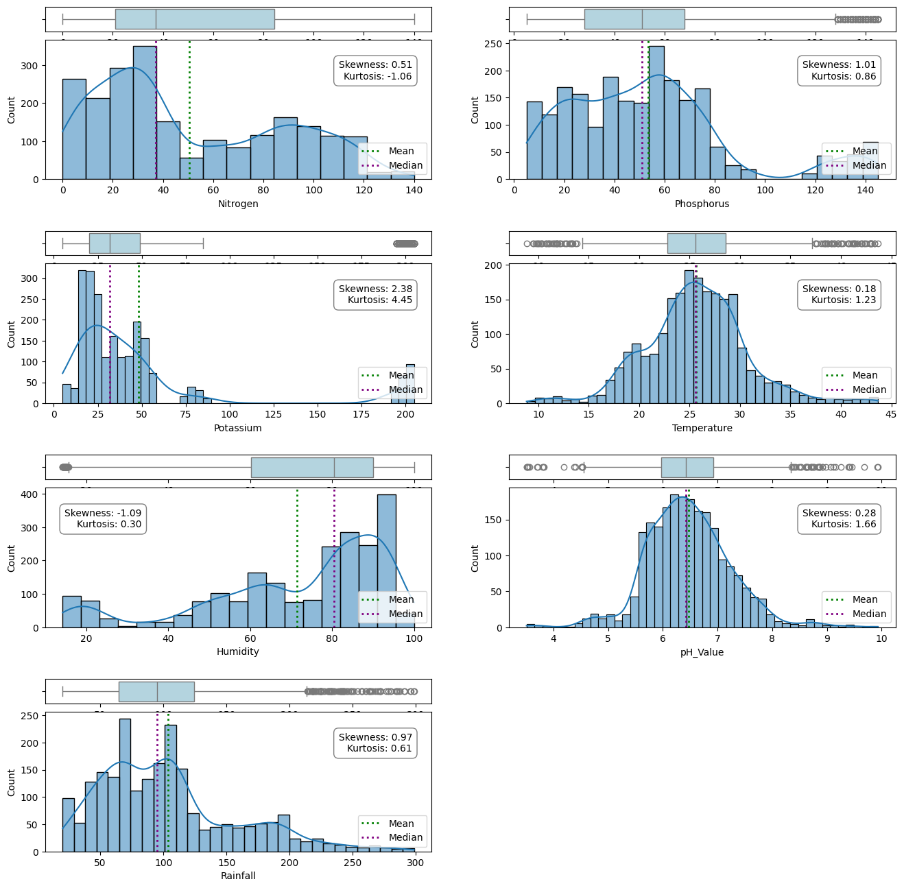

```python
import pandas as pd
import matplotlib.pyplot as plt
from matplotlib.gridspec import GridSpec, GridSpecFromSubplotSpec
import seaborn as sb
import numpy as np
```


```python
{
	"language": "python",
	"execution_count": 18,
	"metadata": {}
}
```


    {'language': 'python', 'execution_count': 18, 'metadata': {}}


## DATA LOADING AND PRE-PROCESSING:


```python
file_path= r"C:\Users\subha\Desktop\AgriSage\Data\Crop_Recommendation.csv"
raw_data= pd.read_csv (file_path)
```


```python
raw_data.head()
```


<div>
<style scoped>
    .dataframe tbody tr th:only-of-type {
        vertical-align: middle;
    }

    .dataframe tbody tr th {
        vertical-align: top;
    }

    .dataframe thead th {
        text-align: right;
    }
</style>
<table border="1" class="dataframe">
  <thead>
    <tr style="text-align: right;">
      <th></th>
      <th>Nitrogen</th>
      <th>Phosphorus</th>
      <th>Potassium</th>
      <th>Temperature</th>
      <th>Humidity</th>
      <th>pH_Value</th>
      <th>Rainfall</th>
      <th>Crop</th>
    </tr>
  </thead>
  <tbody>
    <tr>
      <th>0</th>
      <td>90</td>
      <td>42</td>
      <td>43</td>
      <td>20.879744</td>
      <td>82.002744</td>
      <td>6.502985</td>
      <td>202.935536</td>
      <td>Rice</td>
    </tr>
    <tr>
      <th>1</th>
      <td>85</td>
      <td>58</td>
      <td>41</td>
      <td>21.770462</td>
      <td>80.319644</td>
      <td>7.038096</td>
      <td>226.655537</td>
      <td>Rice</td>
    </tr>
    <tr>
      <th>2</th>
      <td>60</td>
      <td>55</td>
      <td>44</td>
      <td>23.004459</td>
      <td>82.320763</td>
      <td>7.840207</td>
      <td>263.964248</td>
      <td>Rice</td>
    </tr>
    <tr>
      <th>3</th>
      <td>74</td>
      <td>35</td>
      <td>40</td>
      <td>26.491096</td>
      <td>80.158363</td>
      <td>6.980401</td>
      <td>242.864034</td>
      <td>Rice</td>
    </tr>
    <tr>
      <th>4</th>
      <td>78</td>
      <td>42</td>
      <td>42</td>
      <td>20.130175</td>
      <td>81.604873</td>
      <td>7.628473</td>
      <td>262.717340</td>
      <td>Rice</td>
    </tr>
  </tbody>
</table>
</div>


```python
raw_data.tail()
```


<div>
<style scoped>
    .dataframe tbody tr th:only-of-type {
        vertical-align: middle;
    }

    .dataframe tbody tr th {
        vertical-align: top;
    }

    .dataframe thead th {
        text-align: right;
    }
</style>
<table border="1" class="dataframe">
  <thead>
    <tr style="text-align: right;">
      <th></th>
      <th>Nitrogen</th>
      <th>Phosphorus</th>
      <th>Potassium</th>
      <th>Temperature</th>
      <th>Humidity</th>
      <th>pH_Value</th>
      <th>Rainfall</th>
      <th>Crop</th>
    </tr>
  </thead>
  <tbody>
    <tr>
      <th>2195</th>
      <td>107</td>
      <td>34</td>
      <td>32</td>
      <td>26.774637</td>
      <td>66.413269</td>
      <td>6.780064</td>
      <td>177.774507</td>
      <td>Coffee</td>
    </tr>
    <tr>
      <th>2196</th>
      <td>99</td>
      <td>15</td>
      <td>27</td>
      <td>27.417112</td>
      <td>56.636362</td>
      <td>6.086922</td>
      <td>127.924610</td>
      <td>Coffee</td>
    </tr>
    <tr>
      <th>2197</th>
      <td>118</td>
      <td>33</td>
      <td>30</td>
      <td>24.131797</td>
      <td>67.225123</td>
      <td>6.362608</td>
      <td>173.322839</td>
      <td>Coffee</td>
    </tr>
    <tr>
      <th>2198</th>
      <td>117</td>
      <td>32</td>
      <td>34</td>
      <td>26.272418</td>
      <td>52.127394</td>
      <td>6.758793</td>
      <td>127.175293</td>
      <td>Coffee</td>
    </tr>
    <tr>
      <th>2199</th>
      <td>104</td>
      <td>18</td>
      <td>30</td>
      <td>23.603016</td>
      <td>60.396475</td>
      <td>6.779833</td>
      <td>140.937041</td>
      <td>Coffee</td>
    </tr>
  </tbody>
</table>
</div>


```python
raw_data.info()
```

    <class 'pandas.core.frame.DataFrame'>
    RangeIndex: 2200 entries, 0 to 2199
    Data columns (total 8 columns):
     #   Column       Non-Null Count  Dtype  
    ---  ------       --------------  -----  
     0   Nitrogen     2200 non-null   int64  
     1   Phosphorus   2200 non-null   int64  
     2   Potassium    2200 non-null   int64  
     3   Temperature  2200 non-null   float64
     4   Humidity     2200 non-null   float64
     5   pH_Value     2200 non-null   float64
     6   Rainfall     2200 non-null   float64
     7   Crop         2200 non-null   object 
    dtypes: float64(4), int64(3), object(1)
    memory usage: 137.6+ KB
    


```python
raw_data.duplicated().sum()
```


    0


```python
count = raw_data.isnull().sum()[raw_data.isnull().sum() > 0]
percentage = (count / raw_data.shape[0]) * 100

print(count.shape[0], 'columns has missing values')
print('-'*50)
print(pd.DataFrame({'Count':count, 'Percentage %':percentage}))
```

    0 columns has missing values
    --------------------------------------------------
    Empty DataFrame
    Columns: [Count, Percentage %]
    Index: []
    


```python
raw_data.dtypes
```


    Nitrogen         int64
    Phosphorus       int64
    Potassium        int64
    Temperature    float64
    Humidity       float64
    pH_Value       float64
    Rainfall       float64
    Crop            object
    dtype: object


```python
features= raw_data.columns[:-1]
features
```


    Index(['Nitrogen', 'Phosphorus', 'Potassium', 'Temperature', 'Humidity',
           'pH_Value', 'Rainfall'],
          dtype='object')


```python
raw_data.describe()
```


<div>
<style scoped>
    .dataframe tbody tr th:only-of-type {
        vertical-align: middle;
    }

    .dataframe tbody tr th {
        vertical-align: top;
    }

    .dataframe thead th {
        text-align: right;
    }
</style>
<table border="1" class="dataframe">
  <thead>
    <tr style="text-align: right;">
      <th></th>
      <th>Nitrogen</th>
      <th>Phosphorus</th>
      <th>Potassium</th>
      <th>Temperature</th>
      <th>Humidity</th>
      <th>pH_Value</th>
      <th>Rainfall</th>
    </tr>
  </thead>
  <tbody>
    <tr>
      <th>count</th>
      <td>2200.000000</td>
      <td>2200.000000</td>
      <td>2200.000000</td>
      <td>2200.000000</td>
      <td>2200.000000</td>
      <td>2200.000000</td>
      <td>2200.000000</td>
    </tr>
    <tr>
      <th>mean</th>
      <td>50.551818</td>
      <td>53.362727</td>
      <td>48.149091</td>
      <td>25.616244</td>
      <td>71.481779</td>
      <td>6.469480</td>
      <td>103.463655</td>
    </tr>
    <tr>
      <th>std</th>
      <td>36.917334</td>
      <td>32.985883</td>
      <td>50.647931</td>
      <td>5.063749</td>
      <td>22.263812</td>
      <td>0.773938</td>
      <td>54.958389</td>
    </tr>
    <tr>
      <th>min</th>
      <td>0.000000</td>
      <td>5.000000</td>
      <td>5.000000</td>
      <td>8.825675</td>
      <td>14.258040</td>
      <td>3.504752</td>
      <td>20.211267</td>
    </tr>
    <tr>
      <th>25%</th>
      <td>21.000000</td>
      <td>28.000000</td>
      <td>20.000000</td>
      <td>22.769375</td>
      <td>60.261953</td>
      <td>5.971693</td>
      <td>64.551686</td>
    </tr>
    <tr>
      <th>50%</th>
      <td>37.000000</td>
      <td>51.000000</td>
      <td>32.000000</td>
      <td>25.598693</td>
      <td>80.473146</td>
      <td>6.425045</td>
      <td>94.867624</td>
    </tr>
    <tr>
      <th>75%</th>
      <td>84.250000</td>
      <td>68.000000</td>
      <td>49.000000</td>
      <td>28.561654</td>
      <td>89.948771</td>
      <td>6.923643</td>
      <td>124.267508</td>
    </tr>
    <tr>
      <th>max</th>
      <td>140.000000</td>
      <td>145.000000</td>
      <td>205.000000</td>
      <td>43.675493</td>
      <td>99.981876</td>
      <td>9.935091</td>
      <td>298.560117</td>
    </tr>
  </tbody>
</table>
</div>


```python
target = 'Crop'
```

## Exploratory Data Analysis (EDA):


```python
def plot_counts(data, features, hue=None):
    n_cols = 2 
    n_rows = int(np.ceil(len(features)/n_cols)) 

    # Create figure
    fig, axes = plt.subplots(n_rows, n_cols, figsize=(16, 4*n_rows))
    # Flatten the axes array for easier indexing
    axes = axes.flatten()

    for i, feature in enumerate(features):
        #bar_container = axes[i].bar(df[feature].value_counts().index, df[feature].value_counts().values)
        sb.countplot(
        data = data,
        x = feature,
        palette = 'Paired',
        hue = hue,
        ax = axes[i]
        )
        for p in axes[i].patches:
            label = p.get_height()
            x = p.get_x() + p.get_width() / 2 # Width of the plot
            y = p.get_height() # Height of the plot
            
            rotation = 0
            if hue is not None:
                rotation = 30  # Rotate annotations by 30 degrees if hue is not None

    axes[i].annotate(
        '{:.0f}'.format(label),
        (x, y),
        ha = 'center',
        va = 'center',
        size = 12,
        xytext = (0, 5),
        textcoords = 'offset points',
        rotation = rotation
    )
    axes[i].set(ylabel='Count', title=feature, xlabel='')
    axes[i].tick_params(axis='x', rotation=30)

    # If the number of features is odd, remove the empty subplot
    if len(features) % 2 != 0:
        fig.delaxes(axes[-1])

plt.tight_layout()
plt.show()
```


    <Figure size 640x480 with 0 Axes>


```python
plot_counts(raw_data, [target])
```

    C:\Users\subha\AppData\Local\Temp\ipykernel_11736\1976827825.py:12: FutureWarning: 
    
    Passing `palette` without assigning `hue` is deprecated and will be removed in v0.14.0. Assign the `x` variable to `hue` and set `legend=False` for the same effect.
    
      sb.countplot(
    


    

    


The above figure helps us in a clear visualization of our data. We can say that there are 22 possible targets, that is crops. Moreover, each crop has 100 samples.


```python
plt.figure(figsize=(12, 10))
sb.heatmap(raw_data.corr(numeric_only=True), annot=True, fmt='.2f')
plt.show()
```


    

    


The above figures tells us that Phosphorus and Potassium have a high positive correation. This can be due to several underlying reasons related to soil chemistry, plant physiology, and farming practices. Here are some common reasons why these two nutrients might show correlation:
1) Soil Composition: Phosphorus (P) and potassium (K) availability in soil can be influenced by similar factors such as soil type, pH levels, and organic matter content.
2) Fertilizer Application: Farmers often apply fertilizers that contain both phosphorus and potassium together. This simultaneous application can lead to their concentrations being correlated in the soil.
3) Sampling and Analysis: Sometimes, the correlation observed could be due to the way samples are collected or analyzed. If samples are taken from similar locations or depths within a field, they may show similar nutrient profiles.
4) Environmental Factors: Environmental conditions such as rainfall, temperature, and humidity can affect the mobility and availability of both phosphorus and potassium in the soil. Similar environmental impacts can result in correlated values. In our datset since these factors would be same for a particular area, the correlation is understandable.

Highly correlated variables can adversely affect the performance of predictive models, particularly in regression and classification tasks:
1) It can lead to multicollinearity, where the coefficients become unstable and difficult to interpret in regression models.
2) It can also lead to OVERFITTING occurs when the model captures noise or random fluctuations rather than underlying patterns.


```python
def dist_plot(data, feature_list):
    n_cols= 2 
    n_rows = int(np.ceil(len(feature_list)/n_cols)) 
    # Creating figure
    fig = plt.figure(figsize=(16, 4*n_rows))
    outer = GridSpec(n_rows, n_cols, wspace=0.2, hspace=0.3)

    for i in range(len(feature_list)):
        inner = GridSpecFromSubplotSpec(2, 1, subplot_spec=outer[i], 
                                                 wspace=0.1, hspace=0.1, height_ratios=(0.15, 0.85))
        ax_box= plt.Subplot(fig, inner[0])
        sb.boxplot(data=data, x=feature_list[i], color='lightblue', ax=ax_box)
        ax_box.set_xlabel('')
        fig.add_subplot(ax_box)

        mean_value = data[feature_list[i]].mean()
        median_value = data[feature_list[i]].median()
        ax_hist = plt.Subplot(fig, inner[1])
        sb.histplot(data=data, x=feature_list[i], kde=True, ax=ax_hist)
        ax_hist.axvline(mean_value, color='green', linestyle='dotted', linewidth=2, label='Mean')
        ax_hist.axvline(median_value, color='purple', linestyle='dotted', linewidth=2, label='Median')
        ax_hist.legend(loc='lower right', fontsize=10)

        # Calculate skewness and kurtosis
        skewness = data[feature_list[i]].skew()
        kurt = data[feature_list[i]].kurt()
        if skewness < 0:
            x=0.25
        else:
            x=0.95
        # Add skewness and kurtosis as text on the histogram plot
        ax_hist.text(x, 0.85, f"Skewness: {skewness:.2f}\nKurtosis: {kurt:.2f}", 
                         transform=ax_hist.transAxes, verticalalignment='top', horizontalalignment='right',
                         bbox=dict(facecolor='white', edgecolor='gray', boxstyle='round,pad=0.5'),
                    fontsize=10)
        fig.add_subplot(ax_hist)
    plt.tight_layout()
    plt.show(block=False)
```


```python
dist_plot(raw_data, features)
```

    C:\Users\subha\AppData\Local\Temp\ipykernel_11736\3605438578.py:37: UserWarning: This figure includes Axes that are not compatible with tight_layout, so results might be incorrect.
      plt.tight_layout()
    


    

    


From the above graph, we are able to easily identify the outliers that need to be dealt with as they can negatively influence the performance of machine learning models. These are a few outliers:
1) 100 > Potassium> 200
2) 15> Temperature >40
3) 4> pH_Value >8
4) count > 250

By addressing outliers, we can improve the robustness and reliability of your models. It can also help in better visualization.
